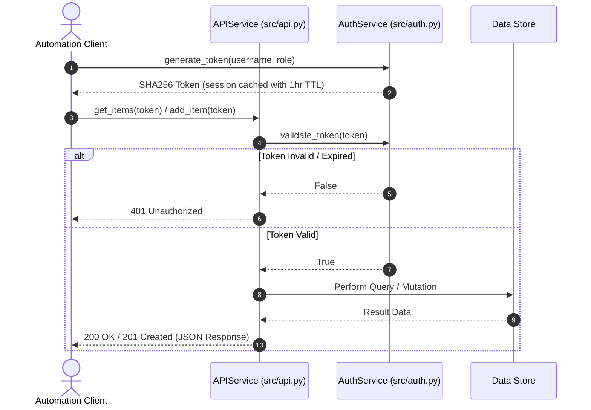
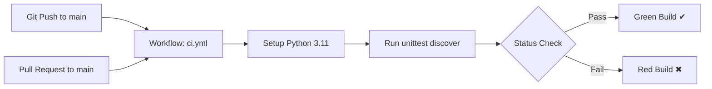

# System Architecture & Design

This document details the system design, communication protocols, security model, and CI/CD automation pipeline for the **Automation Testing** repository.

---

## 1. High-Level Architecture

The repository implements a layered service architecture separating API transport, authentication middleware, and in-memory persistence.

```mermaid
graph TD
    subgraph Clients & Automations
        Client[HTTP Client / Automation Scripts]
        CI[GitHub Actions CI Runner]
    end

    subgraph Application Core
        API[APIService (src/api.py)]
        Auth[AuthService (src/auth.py)]
        Store[(In-Memory Data Store)]
    end

    subgraph Quality Assurance
        Tests[Unit Test Suite (tests/test_api.py)]
    end

    Client -->|HTTP / Method Calls| API
    CI -->|Execute| Tests
    Tests -->|Validate| API
    Tests -->|Validate| Auth
    API -->|Authenticate & Authorize| Auth
    API -->|Read / Write| Store
```

---

## 2. Authentication & Authorization Sequence Flow

The following sequence diagram outlines how requests are validated and authorized:



---

## 3. Core Component Breakdown

### 3.1 API Service (`src/api.py`)
- **Transport / Interface Layer**: Handles endpoint routing, status code generation, and parameter validation.
- **Protected Actions**: Validates caller tokens before accessing protected item resources.
- **Operations**:
  - `health_check()`: Health and version probe (`1.1.0`).
  - `get_items(token)`: List all inventory records.
  - `get_item_by_id(token, item_id)`: Retrieve specific item with 404 boundary handling.
  - `add_item(token, item_name)`: Append new item with auto-incremented ID.
  - `update_item_status(token, item_id, new_status)`: Change item lifecycle state (`active`, `pending`, etc.).
  - `delete_item(token, item_id)`: Remove item by ID.

### 3.2 Authentication Service (`src/auth.py`)
- **Security Middleware**: Manages cryptographic token generation using `SHA-256` hashing with secret key and timestamps.
- **Role-Based Access Control (RBAC)**: Supports roles (`user`, `admin`) attached to session tokens.
- **Session Lifecycle**: In-memory token expiration management with 3600-second TTL.

### 3.3 Test & Verification Suite (`tests/test_api.py`)
- Standardized `unittest` test suite covering authentication mechanics, permission checks, and full API endpoint workflows.

---

## 4. CI/CD & Automation Workflow

The repository includes native GitHub Actions integration:



- **Trigger Events**: `push` and `pull_request` on `main` branch.
- **Runner Environment**: Ubuntu latest, Python 3.11.
- **Execution Target**: `python -m unittest discover -s tests`.
