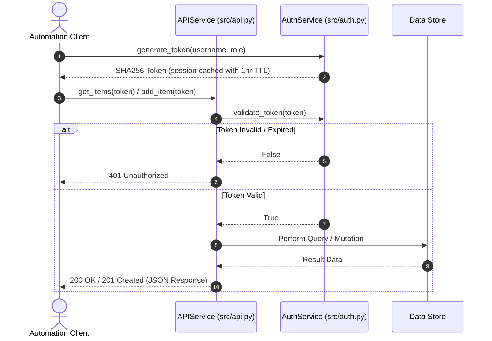
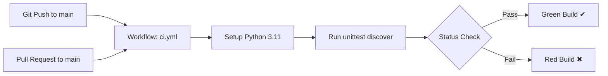

# System Architecture & Design

This document details the system design, communication protocols, security model, and CI/CD automation pipeline for the **Automation Testing** repository.

---

## 1. High-Level Architecture

The repository implements a layered service architecture separating API transport, authentication middleware, and in-memory persistence.

```mermaid
graph TD
    subgraph Clients & Automations
        Client[HTTP Client / Automation Scripts]
        CI[GitHub Actions CI Runner]
    end

    subgraph Application Core
        API[APIService (src/api.py)]
        Auth[AuthService (src/auth.py)]
        Store[(In-Memory Data Store)]
        Workflows[WorkflowEngine (src/workflows.py)]
        Audit[AuditLogManager (src/audit.py)]
        Flags[FeatureFlagManager (src/feature_flags.py)]
        Resilience[ResilienceManager (src/resilience.py)]
        Events[Event Bus (src/events.py)]
    end

    subgraph Quality Assurance
        Tests[Unit Test Suite (tests/test_api.py)]
    end

    Client -->|HTTP / Method Calls| API
    CI -->|Execute| Tests
    Tests -->|Validate| API
    Tests -->|Validate| Auth
    API -->|Authenticate & Authorize| Auth
    API -->|Read / Write| Store
    API -->|Manage & Execute| Workflows
    API -->|Record & Verify| Audit
    API -->|Manage & Evaluate| Flags
    API -->|Manage & Execute| Resilience
    Workflows -->|Publish Events| Events
    Flags -->|Publish Events| Events
    Resilience -->|Publish Events| Events
```

---

## 2. Authentication & Authorization Sequence Flow

The following sequence diagram outlines how requests are validated and authorized:



---

## 3. Core Component Breakdown

### 3.1 API Service (`src/api.py`)
- **Transport / Interface Layer**: Handles endpoint routing, status code generation, and parameter validation.
- **Protected Actions**: Validates caller tokens before accessing protected item resources.
- **Operations**:
  - `health_check()`: Health and version probe (`1.1.0`).
  - `get_items(token)`: List all inventory records.
  - `get_item_by_id(token, item_id)`: Retrieve specific item with 404 boundary handling.
  - `add_item(token, item_name)`: Append new item with auto-incremented ID.
  - `update_item_status(token, item_id, new_status)`: Change item lifecycle state (`active`, `pending`, etc.).
  - `delete_item(token, item_id)`: Remove item by ID.
  - **Workflow Management**:
    - `create_workflow(token, name, steps, ...)`: Register a new automation workflow.
    - `list_workflows(token)` / `get_workflow(token, workflow_id)`: Retrieve workflow definitions.
    - `execute_workflow(token, workflow_id)`: Trigger synchronous execution of a workflow.
    - `list_workflow_executions(token)` / `get_workflow_execution(token, execution_id)`: Track execution history.
  - **Audit Logging & Verification**:
    - `log_audit_event(token, actor, action, ...)`: Record a tamper-evident audit record.
    - `list_audit_logs(token, ...)`: Query audit records with filtering options.
    - `verify_audit_integrity(token)`: Verify cryptographic hash chaining across the audit trail.
  - **Feature Flag Management**:
    - `create_feature_flag(token, name, ...)`: Define a new feature flag.
    - `list_feature_flags(token)` / `get_feature_flag(token, flag_name)`: Retrieve feature flag definitions.
    - `evaluate_feature_flag(token, flag_name, context)`: Evaluate flag status for a specific user or context.
  - **Resilience & Circuit Breaker Management**:
    - `create_circuit_breaker(token, name, ...)`: Register a new circuit breaker.
    - `list_circuit_breakers(token)` / `get_circuit_breaker(token, name)`: Retrieve breaker state.
    - `execute_with_circuit_breaker(token, name, ...)`: Execute an action under circuit breaker protection.

### 3.2 Authentication Service (`src/auth.py`)
- **Security Middleware**: Manages cryptographic token generation using `SHA-256` hashing with secret key and timestamps.
- **Role-Based Access Control (RBAC)**: Supports roles (`user`, `admin`) attached to session tokens.
- **Session Lifecycle**: In-memory token expiration management with 3600-second TTL.

### 3.3 Test & Verification Suite (`tests/test_api.py`)
- Standardized `unittest` test suite covering authentication mechanics, permission checks, and full API endpoint workflows.

### 3.4 Workflow Engine (`src/workflows.py`)
- **Automation & Execution Pipeline**: Manages multi-step synchronous workflows (`Workflow`, `WorkflowStep`, `WorkflowExecution`).
- **Configuration Limits**: Respects execution limits defined in `AppConfig` (such as `workflow_max_steps` and `workflow_execution_timeout_seconds`).
- **Event-Driven Notifications**: Publishes lifecycle events to the internal event bus, including:
  - `workflow_created` / `workflow_deleted`
  - `workflow_execution_started`
  - `workflow_execution_completed` / `workflow_execution_failed`

### 3.5 Audit Log Manager (`src/audit.py`)
- **Tamper-Evident Security Log**: Maintains immutable compliance audit records using SHA-256 cryptographic hash chaining (`AuditRecord` and `AuditLogManager`).
- **Integrity Validation**: Provides cryptographic verification of logs to detect unauthorized tampering or corruption.
- **Configurable Retention**: Respects settings like `audit_retention_days` and `audit_tamper_protection_enabled`.

### 3.6 Feature Flag Manager (`src/feature_flags.py`)
- **Flag Control & Rollouts**: Manages feature toggles with percentage rollouts, user/role targeting, and caching rules.
- **Deterministic Evaluation**: Evaluates flags based on contextual user data and cryptographic hashing.
- **Event Publishing**: Publishes flag lifecycle events (`feature_flag_created`, `feature_flag_toggled`, etc.) to the internal event bus.

### 3.7 Resilience Manager (`src/resilience.py`)
- **Fault Tolerance & Isolation**: Implements circuit breaker state machines (`CLOSED`, `OPEN`, `HALF_OPEN`) to prevent cascading failures.
- **Automatic Recovery**: Automatically transitions breakers to half-open state after recovery timeouts elapse.
- **Event Publishing**: Publishes circuit breaker lifecycle events to the internal event bus.

---

## 4. CI/CD & Automation Workflow

The repository includes native GitHub Actions integration:



- **Trigger Events**: `push` and `pull_request` on `main` branch.
- **Runner Environment**: Ubuntu latest, Python 3.11.
- **Execution Target**: `python -m unittest discover -s tests`.