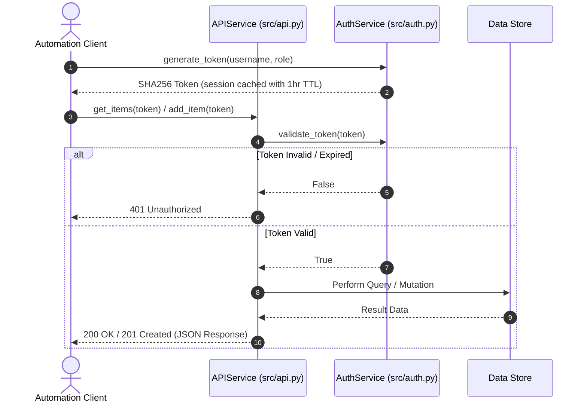

# System Architecture & Design

This document details the system design, communication protocols, security model, and CI/CD automation pipeline for the **Automation Testing** repository.

---

## 1. High-Level Architecture

The repository implements a layered service architecture separating API transport, authentication middleware, and in-memory persistence.

```mermaid
graph TD
    subgraph Clients & Automations
        Client[HTTP Client / Automation Scripts]
        CI[GitHub Actions CI Runner]
    end

    subgraph Application Core
        API[APIService (src/api.py)]
        Auth[AuthService (src/auth.py)]
        Store[(In-Memory Data Store)]
        Workflows[WorkflowEngine (src/workflows.py)]
        Audit[AuditLogManager (src/audit.py)]
        Flags[FeatureFlagManager (src/feature_flags.py)]
        Resilience[ResilienceManager (src/resilience.py)]
        Scheduler[SchedulerEngine (src/scheduler.py)]
        Analytics[AnalyticsEngine (src/analytics.py)]
        Contracts[ContractValidationEngine (src/contracts.py)]
        StreamRouter[StreamRouterEngine (src/stream_router.py)]
        Throttler[TrafficThrottler (src/throttler.py)]
        Leases[LeaseManager (src/leases.py)]
        Events[Event Bus (src/events.py)]
    end

    subgraph Quality Assurance
        Tests[Unit Test Suite (tests/test_api.py)]
    end

    Client -->|HTTP / Method Calls| API
    CI -->|Execute| Tests
    Tests -->|Validate| API
    Tests -->|Validate| Auth
    API -->|Authenticate & Authorize| Auth
    API -->|Read / Write| Store
    API -->|Manage & Execute| Workflows
    API -->|Record & Verify| Audit
    API -->|Manage & Evaluate| Flags
    API -->|Manage & Execute| Resilience
    API -->|Manage & Trigger| Scheduler
    API -->|Ingest & Query| Analytics
    API -->|Register & Validate| Contracts
    API -->|Route & Stream| StreamRouter
    API -->|Evaluate & Limit| Throttler
    API -->|Acquire & Manage| Leases
    Workflows -->|Publish Events| Events
    Flags -->|Publish Events| Events
    Resilience -->|Publish Events| Events
    Scheduler -->|Publish Events| Events
    Analytics -->|Publish Events| Events
    Contracts -->|Publish Events| Events
    StreamRouter -->|Publish Events| Events
    Throttler -->|Publish Events| Events
    Leases -->|Publish Events| Events
end
```

---

## 2. Authentication & Authorization Sequence Flow

The following sequence diagram outlines how requests are validated and authorized:

```mermaid
sequenceDiagram
    autonumber
    actor Client as Automation Client
    participant API as APIService (src/api.py)
    participant Auth as AuthService (src/auth.py)
    participant Store as Data Store

    Client->>Auth: generate_token(username, role)
    Auth-->>Client: SHA256 Token (session cached with 1hr TTL)
    
    Client->>API: get_items(token) / add_item(token)
    API->>Auth: validate_token(token)
    
    alt Token Invalid / Expired
        Auth-->>API: False
        API-->>Client: 401 Unauthorized
    else Token Valid
        Auth-->>API: True
        API->>Store: Perform Query / Mutation
        Store-->>API: Result Data
        API-->>Client: 200 OK / 201 Created (JSON Response)
    end
```

---

## 3. Core Component Breakdown

### 3.1 API Service (`src/api.py`)
- **Transport / Interface Layer**: Handles endpoint routing, status code generation, and parameter validation.
- **Protected Actions**: Validates caller tokens before accessing protected item resources.
- **Operations`**:
  - `health_check()`: Health and version probe (`1.1.0`).
  - `get_items(token)`: List all inventory records.
  - `get_item_by_id(token, item_id)`: Retrieve specific item with 404 boundary handling.
  - `add_item(token, item_name)`: Append new item with auto-incremented ID.
  - `update_item_status(token, item_id, new_status)`: Change item lifecycle state (`active`, `pending`, etc.).
  - `delete_item(token, item_id)`: Remove item by ID.
  - **Workflow Management**: Create, list, retrieve, and execute automation workflows and track execution history.
  - **Audit Logging & Verification**: Record tamper-evident audit records and verify cryptographic hash chaining.
  - **Feature Flag Management**: Define, retrieve, and evaluate feature flag statuses.
  - **Resilience & Circuit Breaker Management**: Register and execute actions under circuit breaker protection.
  - **Background Task Scheduling**: Schedule, pause, resume, trigger, and cancel cron-based tasks.
  - **Analytics & Telemetry**: Ingest time-series metrics, track user funnels, and retrieve reports.
  - **Contract Validation Management**: Register API schemas and validate payloads.
  - **Stream Router & Event Streaming**: Publish, subscribe, poll, acknowledge, and replay stream messages and dead letters.
  - **Traffic Throttling & Rate Limiting**: Register rate-limiting rules and manage client blacklists.
  - **Distributed Leases (`src/leases.py`)**: Acquire, renew, release, inspect, and force-break exclusive resource lease locks with fencing tokens.

### 3.2 Authentication Service (`src/auth.py`)
- **Security Middleware**: Manages cryptographic token generation using `SHA-256` hashing with secret key and timestamps.
- **Role-Based Access Control (RBAC)**: Supports roles (`user`, `admin`) attached to session tokens.
- **Session Lifecycle**: In-memory token expiration management with 3600-second TTL.